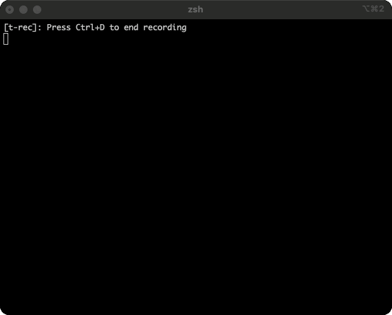

# `please` AI

[](https://github.com/iishyfishyy/please/releases)
[](https://github.com/iishyfishyy/please/actions)
[](LICENSE)
[](go.mod)

`please` converts your natural language queries into the respective terminal command.



Unlike other similar tools that require API keys (which usually require a purchase of separate credits), `please` is powered by headless mode of agents you have installed on your machine.

You can teach `please` about your internal/proprietary tools by configuring it with your docuentation. `please` can use simple keyword matching and/or RAG to answer queries based on your documentation. The tool can generate embeddings locally (Ollama) or via OpenAI's embeddings API (requires your own OpenAI API key).

**Currently, only Claude Code is supported.**

I plan to add the following in the near future, as they both also support headless mode.
- Codex CLI
- Block's Goose CLI

## Features

- **Natural language commands** - No need to remember complex syntax
- **Custom commands** - Teach `please` about your internal/proprietary tools
- **Interactive confirmation** - Review commands before execution
- **Iterative refinement** - Iterate & modify generated commands with natural language
- **Command history** - Tracks all your requests and executions
- **Smart matching** - Keyword or semantic search for custom commands

## Installation

### Prerequisites

- Claude CLI ([installation instructions](https://github.com/anthropics/claude-cli))

First, install and authenticate with Claude CLI:

```bash
# Install Claude CLI (follow official instructions)
# Then authenticate:
claude
```

### Quick Install

Choose your preferred installation method:

#### Homebrew (macOS/Linux)

```bash
brew install iishyfishyy/tap/please
```

#### Install Script (macOS/Linux/Windows)

```bash
curl -sSL https://raw.githubusercontent.com/iishyfishyy/please/main/install.sh | bash
```

#### Go Install

```bash
go install github.com/iishyfishyy/please/cmd/please@latest
```

#### Download Binary

Download the latest release for your platform from the [releases page](https://github.com/iishyfishyy/please/releases/latest).

#### Build from Source

```bash
git clone https://github.com/iishyfishyy/please.git
cd please
go build -o please ./cmd/please
sudo mv please /usr/local/bin/
```

## Quick Start

### 1. Configure

Run the configuration wizard:

```bash
please configure
```

This will:
- Check if Claude CLI is installed and authenticated
- Verify the connection is working
- Save your configuration to `~/.please/config.json`

### 2. Use it

Simply prefix your request with `please`:

```bash
please "list all files"
please "find all javascript files modified in the last week"
please "show disk usage sorted by size"
please "create a git branch called feature-x"
please "compress all images in this directory"
```

### 3. Review and execute

`please` will:
1. Generate the appropriate command
2. Show you the command for review
3. Ask what you want to do (keyboard shortcuts):
   - **[r] Run it** - Execute the command immediately
   - **[e] Explain** - Get a detailed explanation of what the command does
   - **[m] Modify it** - Refine the command with natural language
   - **[c] Copy to clipboard** - Copy the command without running
   - **[q] Cancel** - Exit without running anything

## Configuration

Configuration is stored in `~/.please/config.json`.

### Complete Configuration Schema

```json
{
  "agent": "claude-code",
  "custom_commands": {
    "enabled": true,
    "provider": "ollama",
    "matching": {
      "strategy": "hybrid",
      "keyword_threshold": 50,
      "max_docs_per_request": 3,
      "token_budget": 1500
    },
    "ollama": {
      "url": "http://localhost:11434",
      "model": "nomic-embed-text",
      "dimensions": 384
    },
    "openai": {
      "api_key": "",
      "api_key_env": "OPENAI_API_KEY",
      "use_env_var": true,
      "model": "text-embedding-3-small",
      "dimensions": 1536
    }
  }
}
```

### Configuration Options

**`agent`** (string, required)
- Currently only `"claude-code"` is supported
- Future: `"codex"`, `"goose"`

**`custom_commands.enabled`** (boolean)
- `true`: Enable custom command documentation
- `false`: Disable custom commands feature

**`custom_commands.provider`** (string)
- `"none"`: Keyword-only matching (fast, no dependencies)
- `"ollama"`: Local embeddings (private, free)
- `"openai"`: Cloud embeddings (accurate, requires API key)

**`custom_commands.matching.strategy`** (string)
- `"keyword"`: Fast keyword matching only
- `"semantic"`: Semantic search only (requires provider)
- `"hybrid"`: Try keyword first, fallback to semantic (recommended)

**`custom_commands.matching.keyword_threshold`** (integer)
- Minimum score for keyword matches (default: 50)
- Lower = more matches, higher = stricter matching

**`custom_commands.matching.max_docs_per_request`** (integer)
- Maximum custom commands to include in context (default: 3)
- Higher = more context, but uses more tokens

**`custom_commands.matching.token_budget`** (integer)
- Maximum tokens for custom command context (default: 1500)
- Controls how much documentation is sent to the LLM

### Example Configurations

**Minimal (keyword-only, no embeddings)**:
```json
{
  "agent": "claude-code",
  "custom_commands": {
    "enabled": true,
    "provider": "none",
    "matching": {
      "strategy": "keyword"
    }
  }
}
```

**Local with Ollama (privacy-focused)**:
```json
{
  "agent": "claude-code",
  "custom_commands": {
    "enabled": true,
    "provider": "ollama",
    "matching": {
      "strategy": "hybrid",
      "keyword_threshold": 50,
      "max_docs_per_request": 3
    },
    "ollama": {
      "url": "http://localhost:11434",
      "model": "nomic-embed-text"
    }
  }
}
```

**Cloud with OpenAI (most accurate)**:
```json
{
  "agent": "claude-code",
  "custom_commands": {
    "enabled": true,
    "provider": "openai",
    "matching": {
      "strategy": "hybrid",
      "max_docs_per_request": 3
    },
    "openai": {
      "api_key_env": "OPENAI_API_KEY",
      "use_env_var": true,
      "model": "text-embedding-3-small"
    }
  }
}
```

**Note**: Authentication for Claude is handled by the Claude CLI, so no API keys are stored in config for the main agent. OpenAI API keys (for embeddings only) can be stored in environment variables (recommended) or in the config file.

## Custom Commands

### Overview

Custom commands let you teach `please` about proprietary, internal, or specialized tools that Claude doesn't know about. You simply create markdown documentation files with examples, and `please` uses them to generate accurate commands.

**Perfect for**:
- Internal company tools and deployment systems
- Custom scripts and proprietary utilities
- Specialized domain-specific tools
- Non-standard command-line applications

### How It Works

```
1. You create: ~/.please/commands/deploy-tool.md
   (Contains examples: "deploy to staging" → deploy-tool --env=staging)

2. You run: please index
   (Indexes your documentation for fast lookup)

3. You use: please "deploy my app to staging"

4. please finds your docs, sends context to Claude

5. Claude generates: deploy-tool --env=staging --confirm
```

### Quick Start

**Step 1: Configure custom commands**

```bash
please configure
```

You'll be prompted to choose an embedding provider:
- **None**: Fast keyword-only matching, no setup required
- **Ollama**: Local embeddings, 100% private, free (recommended for privacy)
- **OpenAI**: Cloud embeddings, most accurate (requires API key)

**Step 2: Create a documentation file**

Create `~/.please/commands/deploy-tool.md`:

```markdown
---
command: deploy-tool
aliases: ["deploy", "dt"]
keywords: ["deploy", "staging", "production", "release"]
priority: high
---

# Internal Deployment Tool

Our custom deployment tool for managing releases.

## Examples

**User**: "deploy to staging"
**Command**: `deploy-tool --env=staging --confirm`

**User**: "deploy version 1.2.3 to production"
**Command**: `deploy-tool --env=production --version=1.2.3 --confirm`

**User**: "rollback production"
**Command**: `deploy-tool --env=production --rollback`
```

**Step 3: Index your commands**

```bash
please index
```

**Step 4: Use it!**

```bash
$ please "deploy to staging"

Generated command:
  deploy-tool --env=staging --confirm

What would you like to do (keyboard shortcuts):
  [r] Run it
  [e] Explain
  [m] Modify it
  [c] Copy to clipboard
  [q] Cancel
```

### Documentation File Format

Create markdown files in `~/.please/commands/{tool-name}.md` with YAML frontmatter and examples:

**Required fields**:
```markdown
---
command: kubectl              # Primary command name (required)
---
```

**Recommended fields**:
```markdown
---
command: kubectl
aliases: ["k8s", "kube"]      # Alternative names
keywords: ["kubernetes", "pods", "deployments", "k8s"]
priority: high                # high/medium/low (affects ranking)
categories: ["devops"]        # For organization
---

# Brief Description

What this tool does in 1-2 sentences.

## Examples

**User**: "show all pods"
**Command**: `kubectl get pods`

**User**: "get logs from nginx"
**Command**: `kubectl logs nginx`

**User**: "describe deployment myapp"
**Command**: `kubectl describe deployment myapp`
```

**Tips for great documentation**:
- Add 10-15 diverse examples covering common use cases
- Include keywords that users might naturally say (synonyms, abbreviations)
- Use `priority: high` for your most-used commands
- Keep descriptions concise - examples are more important

### Matching Strategies

Choose the right strategy for your needs:

| Strategy | Speed | Accuracy | Setup | When to Use |
|----------|-------|----------|-------|-------------|
| **Keyword** | Fast | OK | None | Exact keyword matches, offline use |
| **Hybrid** | Medium | Best | Ollama/OpenAI | Most use cases (recommended) |
| **Semantic** | Slower | Best | Ollama/OpenAI | Complex queries, synonyms matter |

**Keyword**: Matches based on exact words in your frontmatter (command, keywords, aliases)
- No setup, works offline
- Very fast
- Misses synonyms ("k8s" won't match "kubernetes" unless you add it to aliases)

**Hybrid**: Tries keyword first, falls back to semantic if no good matches
- Fast when keywords match
- Understands synonyms and paraphrasing
- Best of both worlds
- Requires Ollama or OpenAI setup

**Semantic**: Always uses embeddings and vector similarity
- Best for natural language understanding
- Finds relevant docs even with different wording
- Slower than keyword
- Requires Ollama or OpenAI setup

**Configuration**:
```json
{
  "custom_commands": {
    "matching": {
      "strategy": "hybrid",          // or "keyword" or "semantic"
      "keyword_threshold": 50,       // Minimum score for keyword matches
      "max_docs_per_request": 3      // How many docs to send to Claude
    }
  }
}
```

### Embedding Providers

Choose between local privacy or cloud accuracy:

#### Ollama (Local & Private)

**Pros**:
- 100% private - no data leaves your machine
- Free forever, no API costs
- Fast (~50-100ms per search)
- Works offline

**Cons**:
- Requires installation (~2GB disk space)
- Slightly less accurate than OpenAI

**Setup**:
```bash
# macOS
brew install ollama

# Linux
curl -fsSL https://ollama.com/install.sh | sh

# Start Ollama
ollama serve

# Configure please
please configure
# Select "Local (Ollama)" when prompted
```

Model: `nomic-embed-text` (384 dimensions, auto-downloaded)

#### OpenAI (Cloud & Accurate)

**Pros**:
- Most accurate semantic matching
- No local installation needed
- Very cheap ($0.02 per 1M tokens ≈ $0.0001 per index)

**Cons**:
- Requires API key and account
- Data sent to OpenAI servers
- Requires internet connection

**Setup**:
```bash
# Get API key from https://platform.openai.com/api-keys

# Option 1: Environment variable (recommended)
export OPENAI_API_KEY="sk-..."

# Option 2: Store in config (less secure)
please configure
# Select "OpenAI API" and enter key when prompted
```

Model: `text-embedding-3-small` (1536 dimensions)

#### None (Keyword-Only)

**Pros**:
- No setup required
- Fastest option
- Works offline
- No dependencies

**Cons**:
- Less accurate than semantic search
- Misses synonyms and paraphrasing

**Use when**: You have good keywords and exact matching is sufficient

### Available Commands

```bash
# Index or reindex your documentation
please index
# Output: "✓ Indexed 5 commands from ~/.please/commands/"

# List all indexed commands with details
please list-commands
# Shows: command names, aliases, example counts, files

# Configure or reconfigure settings
please configure
# Interactive wizard for agent and custom commands
```

### Best Practices

**Writing great documentation**:

1. **10-15 diverse examples** - Cover common use cases and variations
   ```markdown
   **User**: "deploy to prod"
   **User**: "deploy v1.2.3 to production"
   **User**: "rollback production to previous version"
   ```

2. **Rich keywords** - Think like your users
   ```yaml
   keywords: ["deploy", "release", "push", "ship", "prod", "staging"]
   ```

3. **Useful aliases** - Alternative names people might use
   ```yaml
   aliases: ["deploy", "dt", "release-tool"]
   ```

4. **Set priorities** - Help ranking for your most-used tools
   ```yaml
   priority: high  # for daily-use tools
   priority: medium  # for occasional tools
   priority: low  # for rarely-used tools
   ```

5. **Keep it updated** - Reindex when you make changes
   ```bash
   # Edit your .md files, then:
   please index
   ```

### Troubleshooting

**Problem: "No custom commands found"**

```bash
# Check if commands directory exists
ls ~/.please/commands/
# Should show your .md files

# Check if custom commands are enabled
cat ~/.please/config.json
# Look for "enabled": true

# Try reindexing
please index
```

**Problem: "Failed to connect to Ollama"**

```bash
# Check if Ollama is running
curl http://localhost:11434/api/tags

# If not running, start it
ollama serve

# Or on macOS (if installed as service)
brew services start ollama
```

**Problem: "Commands not matching my queries"**

**Solution 1**: Add more keywords
```yaml
# Before
keywords: ["deploy"]

# After
keywords: ["deploy", "release", "push", "ship", "staging", "prod", "production"]
```

**Solution 2**: Add more examples
```markdown
# Add variations of how users might ask
**User**: "push to prod"
**User**: "ship to production"
**User**: "release to staging environment"
```

**Solution 3**: Try a different strategy
```bash
# Edit ~/.please/config.json
{
  "custom_commands": {
    "matching": {
      "strategy": "semantic",  // Instead of "keyword"
      "keyword_threshold": 30  // Lower threshold (default: 50)
    }
  }
}
```

**Problem: "OpenAI API authentication failed"**

```bash
# Check environment variable
echo $OPENAI_API_KEY

# If empty, set it
export OPENAI_API_KEY="sk-your-key-here"

# Or reconfigure
please configure
```

## Command History

All requests and executions are logged to `~/.please/history.json`:

```json
{
  "entries": [
    {
      "timestamp": "2025-01-15T10:30:00Z",
      "original_request": "find large files",
      "final_command": "find . -type f -size +100M",
      "executed": true,
      "modifications": []
    }
  ]
}
```

## Tips

- Be specific about what you want to accomplish
- You can chain operations in your request
- The tool understands context about your OS and shell

## Safety

`please` always shows you the command before execution and asks for confirmation. However:

- **Review commands carefully** before running
- **Understand what the command does** before confirming
- **Be cautious with destructive operations** (rm, dd, etc.)
- **Backup important data** before running unfamiliar commands

## Development

### Project Structure

```
please/
├── cmd/
│   └── please/              # Main CLI entry point
├── internal/
│   ├── agent/               # LLM agent implementations
│   ├── config/              # Configuration management
│   ├── customcmd/           # Custom commands RAG system
│   │   ├── embeddings/      # Embedding providers (Ollama, OpenAI)
│   │   └── vectorstore/     # Vector storage and similarity search
│   ├── executor/            # Safe command execution
│   ├── history/             # Command history tracking
│   └── ui/                  # Interactive prompts and display
├── templates/               # Template files
├── CLAUDE.md                # Project documentation for Claude
├── README.md                # This file
└── go.mod                   # Go module definition
```

## Roadmap

### Planned
- [ ] Support for additional LLM providers (Codex, Goose, etc.)
- [ ] Command suggestions based on history
- [ ] Multi-step command workflows

## Contributing

Contributions are welcome! Please feel free to submit a PR.

---

**Note**: This tool executes shell commands on your system. Always review generated commands before running them. Use at your own risk.
